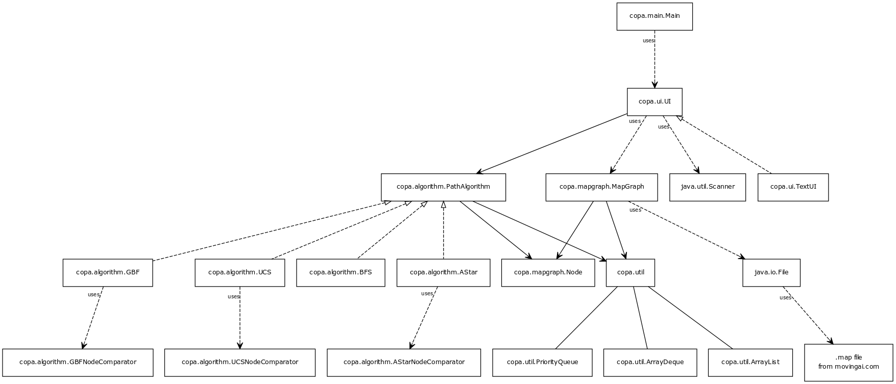
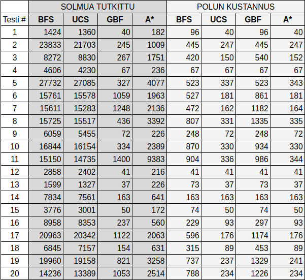
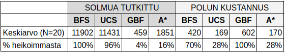
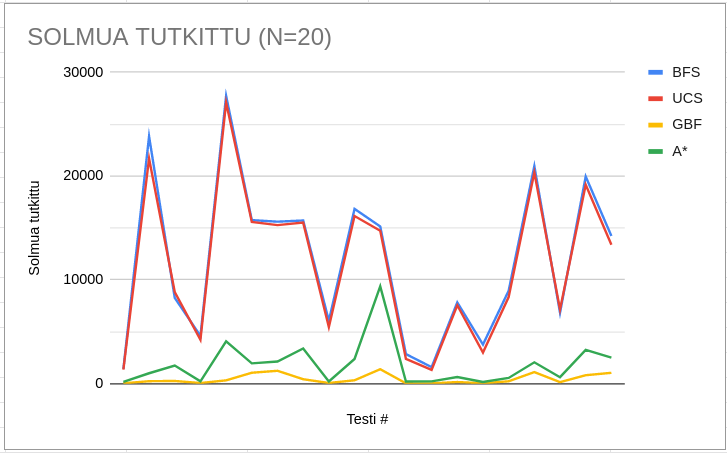
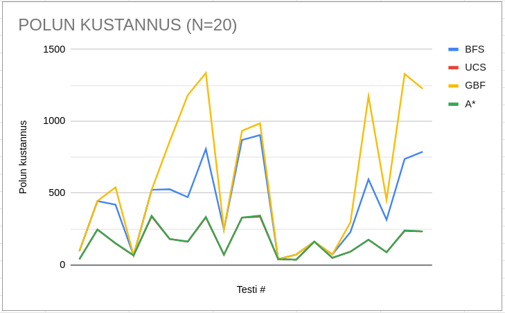

# Toteutusdokumentti

## Ohjelman yleisrakenne

* Ohjelmasta löytyy viisi pakettia:
    * **copa.main** pääohjelma
    * **copa.algorithm** sisältää polkualgoritmirajapinnan ja sitä toteuttavat luokat kaikille algoritmeille ja NodeComparator-luokat niitä tarvitseville algoritmeille. Algoritmien NodeComparator-luokat sisältävät ainoastaan logiikan kahden Node-olion vertailua varten. 
    * **copa.mapgraph** sisältää luokan MapGraph, jossa mm. metodit ASCII-kartan muuntamiseksi verkoksi ja kartan piirtämiseksi näytölle. Lisäksi luokka Node kartan solmuja varten.
    * **copa.ui** sisältää käyttöliittymärajapinnan sekä sitä toteuttavan tekstikäyttöliittymäluokan. 
    * **copa.util** sisältää Javan java.util paketin toteutuksia korvaavat luokat PriorityQueue, ArrayDeque ja ArrayList.

* Ohessa tyhjentävä kaavio ohjelman luokkien toteuttamasta sovelluslogiikasta:

## Algoritmien O-analyysi

Ennen algoritmien O-analyysia on syytä huomauttaa, että toteuttamani algoritmit eivät ole edustamiensa algoritmien puhtaita versioita vaan muunnelmia, joiden aikavaativuus on jonkin verran "puhtaita versioita" korkeampi. Projektissa käyttämieni karttojen luonteesta johtuen olen lisännyt kaikkiin neljään algoritmiin ns. naapurisolmun tarkkailuvaiheen, jolla suljetaan jatkokäsittelystä pois solmut, joihin ei voi siirtyä (kartoissa merkattu merkillä "@"). Tämä lisää luonnollisesti algoritmien prosessointiaikaa. Yksittäisen tarkistuksen toteutus tapahtuu kuitenkin vakioajassa kaksiulotteisen boolean-taulukon avulla: algoritmi tarkistaa ajassa O(1) onko solmua noteerattu (noticed). Jos tulos on ``false``, suoritetaan ajassa O(1) taulukon päivitys kyseisen solun osalta tilaan ``true``. Tarkistuksen aikavaativuus on siis pahimmassa tapauksessa O(2 * *n* * 1) = O(2*n*) = O(*n*), kun *n* = kartan solmujen määrä. Tämä pätee siis kaikkien valittujen algoritmien osalta, joten en käy sitä uudelleen läpi seuraavissa algortimikohtaisissa O-analyyseissa sen tarkemmin.

Todetaan vielä sekin, että pääosin tämän havainnointihaasteen takia en nähnyt järkeväksi alkaa kellottamaan suorituskykyvertailun empiirisessä osassa algoritmien suoritusaikoja, vaan valitsin metriikoiksi omasta mielestäni mielekkäämmät "solmua tutkittu" ja "polun kustannus". Tämän valinnan mielekkyydestä saa olla eri mieltä, mutta näin päätin tehdä jo projektin alkuvaiheessa enkä tätä myöhemmin muuttanut.

### Perinteinen leveyshaku (BFS)

Algoritmi lisää pahimmassa tapauksessa kaikki verkon solmut jonoon ja käsittelee jokaisen solmun ja kaaren kerran. Lisäksi solmujen tarkistuksen osalta kuluu pahimmillaan aikaa O(*n*), joten aikavaativuus on O(2*n* + *m*) = O(*n* + *m*).

### Dijkstran Uniform Cost Search (UCS) -algoritmi

Algoritmi käy pahimmassa tapauksessa läpi verkon kaikki solmut ja kaaret, missä kuluu aikaa O(*n* + *m*), missä *m* = kaarien lukumäärä. Lisäksi algoritmi lisää kekoon solmuja, mikä vie pahimmillaan aikaa O(*m* log *m*). Lisäksi solmujen tarkistuksen osalta kuluu pahimmillaan aikaa O(*n*), joten aikavaativuus on (2*n* + *m* log *m*) = (*n* + *m* log *m*).

### Greedy Best First (GBF) -algoritmi

Algoritmi lisää kekoon ainoastaan maalisolmua lähimmän solmun, eli sen "branching factor" on pääsääntöisesti 1. Merkitään *b* = branching factor ja *s* = keon maksimisyvyys = log *m*. Esimerkiksi [tämän verkosta löytyvän analyysin perusteella](https://ai.stackexchange.com/questions/8902/what-are-the-differences-between-a-and-greedy-best-first-search) kun ottaa huomioon solmujen tarkistukseen kuluvan ajan, tulisi algoritmin aikavaativuuden olla tällöin O(*b*^log *m*).

Algoritmin tilavaativuus on ymmärtääkseni aina vakio O(1), sillä algoritmi tarvitsee muistia ainoastaan yhdelle solmulle, jonka se käsittelee välittömästi.

### A*-algoritmi

Algortimi lisää kekoon solmun, joka minimoi summan kertynyt polkukustannus + Manhattan etäisyys loppusolmuun. GBF-algoritmin tapaan sen aikavaativuuden tulisi olla solmutarkistus huomioiden O(*b*^log *m*), perustuen [samaan lähteeseen kuin edellisessä](https://ai.stackexchange.com/questions/8902/what-are-the-differences-between-a-and-greedy-best-first-search)).

Edelliseen artikkeelin perusteella A*-algortimin tilavaativuus olisi sama O(*b*^log *m*).

## Algoritmien empiirinen suorituskykyvertailu 

### Otoskoko ja vertailuun käytetyt metriikat 

Empiiristä suorituskykyvertailua varten kaikki algortimit ajettiin 20 kertaan, jotta saatiin tämän projektin tarpeita ajatellen tilastollisesti riittävän kattava otos aikaiseksi algoritmien eroista.

Algoritmien suorituskykyä vertaillaan kahdella metriikalla:
* **Polun kustannus**: Algoritmin löytämän polun kokonaiskustannus. Tavallisesta ruudusta kertyy yksi kustannuspiste, puun sisältävästä ruudusta 5 pistettä. Algoritmin suorituskyky on aina sitä parempi, mitä pienempi polun kustannus on.
* **Solmua tutkittu**: Solmujen määrä, joissa algoritmi vierailee. Tämän metriikan voi ajatella vertautuvan algoritmin suorittamiseen kuluvaan aikaan. Algoritmin suorituskyky on aina sitä parempi, mitä vähemmän solmuja tutkitaan.
 

### Suorituskykytestien tulokset

[Taulukossa 1](./analysis/taulukko1.png) on metriikkakohtaiset tulokset testeittäin per algoritmi. 

[Taulukoon 2](./analysis/taulukko2.png) on laskettu kolme vertailevaa tunnuslukua per metriikka:
* **Keskiarvo (N=20)**: testien keskiarvo kyseiselle algoritmille  
* **% testeistä paras suorituskyky**: %-osuus testeistä, joissa algoritmin suorituskyky ollut paras
* **% testeistä heikoin suorituskyky**: %-osuus testeistä, joissa algoritmin suorituskyky ollut heikoin

Testeistä todettakoon, että kolmessa tapauksessa arvottu reitti alkusolmusta loppusolmuun on selvästi ollut esteetön, koska kaikilla algoritmeilla on ollut sama polun kustannus. Tällöin kaikilla algoritmeilla on ollut polun kustannuksen osalta sekä paras että heikoin suorituskyky.

 

Testien eroja on havainnollistettu kahdella kuvaajalla. 

[Kuvaajasta 1](./analysis/kuvaaja1.png) nähdään tutkittujen solmujen vaihtelu testeittäin per algoritmi.

[Kuvaajasta 2](./analysis/kuvaaja1.png) nähdään polun kustannuksen vaihtelu testeittäin per algoritmi.

### Analyysi polkualgoritmien suorituskykyeroista

Suorituskykytestien tulokset olivat ennakko-oletusten mukaisia. 

* **Perinteisen leveyshaun (BFS)** suorituskyky on pääsääntöisesti aina heikoin tutkittujen solmujen osalta. Tämä johtuu algoritmin toimintalogiikasta, joka ei lähtökohtaisesti tee mitään karsintaa tutkittavien verkon solmujen osalta: algoritmi käy orjallisesti läpi jokaisen eteentulevan solmun naapurisolmun, kunnes saavuttaa maalisolmun. Myös algoritmin polun kustannus on esteettömiä reittejä lukuunottamatta aina heikompi kuin UCS- ja A*-algoritmeilla, joskin se on usein suorituskykyisempi kuin GBF-algoritmi. Tämä johtuu ainoastaan GBF-algoritmin ahneesta toimintalogiikasta, joka saa sen helposti eksymään labyrintin poukamiin ja siten keräämään negatiivisia lisäpisteitä poukamien reunojen metsäruuduista. 

* **Dijkstran Uniform Cost Search (UCS) -algoritmin** suorituskyky on tutkittujen solmujen osalta aavistuksen parempi kuin leveyshaulla, mikä selittyy sen tavasta priorisoida tutkittavaksi asetettuja solmuja niiden polun kustannuksen mukaan: algoritmi jättää tutkittavien solmujen listan häntäpäähän puusolmut, joten maalisolmun löydyttyä läpikäytävien solmujen listalla on edelleen poikkeuksetta suurin osa eteen tulleista puusolmuista, jotka leveyshaku on kuitenkin ehtinyt tutkia. Puusolmuja on kuitenkin huomattavasti vähemmän kuin normaaleja solmuja, joten ero leveyshaun suorituskykyyn nähden jää hyvin pieneksi. Polun kustannuksen osalta algoritmin suorituskyky on ylivoimainen: se löytää jokaisessa testitapauksessa pienimmän polun kustannuksen. Tämä johtuu siitä, että algoritmi tutkii aina lähtökohtaisesti ensin edullisen kustannuksen normaalit solmut ja kalliimpia puusolmuja vain siinä tapauksessa, jos prioriteettijonossa ei ole normaaleja solmuja tarjolla. Testi vahvistaa siis teorian todeksi: Dijkstran algoritmi löytää aina taatusti edullisimman polun. 

* **Greedy Best First (GBF) -algoritmin** suorituskyky on ylivoimainen tutkittujen solmujen osalta: se on jokaisessa testissä tutkinut aina pienimmän määrän solmuja. Tämä johtuu algoritmin käyttämästä solmujen priorisointitavasta, joka perustuu ainoastaan maalisolmun Manhattan etäisyyteen tutkittavasta solmusta. Algoritmi jättää siis aina tutkimatta tarkemmin solmut, joiden etäisyys maalisolmusta on pidempi kuin pienimmän mahdollisen Manhattan etäisyyden solmulla. Algoritmin ahneudella on kuitenkin kääntöpuolensa: sillä on jokaisessa testitapauksessa myös kallein polun kustannus, poislukien 3 testitapausta, joissa maali- ja loppusolmun välillä ei ollut esteitä, jolloin algoritmit päätyivät tasapeliin. Algoritmi ei tee eroa normaalin ja puusolmun välillä, joten lisäkustannuksia aiheutuu varsin runsaasti eteentulleista puusolmuista. Erityisen huonosti algoritmi suoriutuu tilanteista, joissa lähtö- ja maalisolmujen välillä on umpikujaan johtavia poukamia. Tällöin algoritmi ohjautuu kulkemaan labyrintin poukamien reunoja pitkin, joista löytyy tyypillisesti paljon puusolmuja, joista kertyy nopeasti suuri lisäkustannus.   

* **A\*-algoritmin** suorituskyky tutkittujen solmujen osalta jää selvästi toiseksi GBF-algoritmiin nähden, mutta se voittaa kuitenkin kirkkaasti BFS- ja UCS-algoritmit. Tämä johtuu algoritmin tavasta priorisoida solmuja: solmun prioriteetti on korkein, jos sen yhteenlaskettu polun kustannus ja Manhattan etäisyys maalisolmusta on pienempi kuin muilla tarkastelulistalle otetuilla solmuilla. GBF-algoritmiin nähden eroa syntyy siis silloin, kun algoritmi pyrki välttämään korkean puusolmun tutkimista, jos se löytää näiden vierestä normaaleja solmuja, joista on pidempi matka maaliin. Huomionarvoista kuitenkin on se, minkälaiset painoarvot normaalile ja puusolmulle on valittu: koska puusolmun painoarvo on vain viisinkertainen normaaliin solmuun nähden, ei algoritmi lähde kiertämään pitkää usean puun muodostamaa metsää, vaan lähtee lopulta kokeilemaan metsän läpi kulkemista. Tällä on suora vaikutus myös polun kustannukseen: useimmissa testitapauksissa viiden puusolmujen lisäkustannus saa algoritmin kiertämään puusolmut ja siten löytämään yhtä optimaalisen polun kuin UCS-algoritmi. Toisinaan suurempi puusolmujen rykelmä on pakottanut algoritmin valitsemaan reitille osuneen puusolmun läpikulkemisen, jolloin polun kokonaiskustannus on saattanut olla aavistuksen UCS-algoritmia pidempi. Polun kustannuksen keskiarvossa on alle prosentin eroavaisuus, joten puiden läpikulkemisia on ollut oletettavasti huomattavan vähän. Painoarvoja muokkaamalla algoritmin suorituskykyä voisi helposti siis muokata: puusolmun kustannuksen painoarvoa höllentämällä polun kustannus saattaisi jonkin verran kasvaa, mutta vastaavasti tutkittujen solmujen määrä laskisi. Ja sama päinvastoin. Optimaalisen tasapainon löytäminen vaatisi herkkyysanalyysia erilaisilla painotuksilla ja useiden lisätestien tekemistä. Toisaalta optimaalinen ratkaisu riippuu myös siitä, kuinka paljon antaa painoarvoa nopeudelle (tutkitut solmut) ja edullisuudelle (polun kustannus). Algoritmin optimointi ei kuitenkaan ollut tämän projektin agendalla, mutta sen automatisointi voisi olla mielenkiintoinen harjoitustyö toisenlaisessa tutkimusasetelmassa.

## Työn mahdolliset puutteet ja parannusehdotukset

* Mikäli algoritmeja haluaa vertailla isommalla otoksella jatkossa, tulisi algoritmien tulosraportointia kehittää käyttäjäystävällisemmäksi. Erillisten algoritmitulosteiden sijaan tulisi luoda yksi taulukko, josta näkee eri algortimikohtaiset metriikat vierekkäin. Samalla tulisi mahdollistaa otoskoon määrittäminen parametrilla, jotta voisi suoraan ajaa vaikka sata testikierrosta ja luoda niistä yhden koostetulosteen keskiarvoineen. Tuloste olisi syytä saada myös esim. pilkku- tai tab-eroteltuna tiedostona ulos, jotta tulosten graafista analyysia  voisi tehdä jossain toisessa työkalussa.

## Lähteet

* Laaksonen, Antti. (2018). Tietorakenteet ja algoritmit.
* Tietorakenteet ja algortimit, Helsingin Yliopiston kurssimateriaalit, kevät 2019
* https://ai.stackexchange.com/questions/8902/what-are-the-differences-between-a-and-greedy-best-first-search