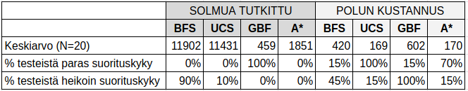

# Toteutusdokumentti

## Ohjelman yleisrakenne

* Ohjelmasta löytyy viisi pakettia:
    * **copa.main** pääohjelma
    * **copa.algorithm** sisältää luokat kaikille algoritmeille ja Comparato-luokat niitä tarvitseville algoritmeille
    * **copa.mapgraph** sisältää luokan MapGraph, jossa mm. metodit ASCII-kartan muuntamiseksi verkoksi ja kartan piirtämiseksi näytölle. Lisäksi luokka Node kartan solmuja varten.
    * **copa.ui** Käyttöliittymän vaatimat luokat. Jo luodun yksinkertaisen tekstikäyttöliittymän lisäksi ei ole aikomusta luoda muunlaisia käyttöliittymiä.
    * **copa.util** sisältää Javan java.util paketin toteutuksia korvaavat luokat PriorityQueue, ArrayDeque ja ArrayList.

## Saavutetut aika- ja tilavaativuudet

(tulossa myöhemmin)

## Algoritmien suorituskykyvertailu ja O-analyysivertailu

### Suorituskyvyn arviointiin käytetyt metriikat ja otoskoko

Algoritmien suorituskykyä vertaillaan kahdella metriikalla:
* **Polun kustannus**: Algoritmin löytämän polun kokonaiskustannus. Tavallisesta ruudusta kertyy yksi kustannuspiste, puun sisältävästä ruudusta 5 pistettä. Algoritmin suorituskyky on aina sitä parempi, mitä pienempi polun kustannus on.
* **Solmua tutkittu**: Solmujen määrä, joissa algoritmi vierailee. Tämän metriikan voi ajatella vertautuvan algoritmin suorittamiseen kuluvaan aikaan. Algoritmin suorituskyky on aina sitä parempi, mitä vähemmän solmuja tutkitaan on.

Analyysia varten kaikki algortimit ajettiin 20 kertaan, jotta saatiin tilastollisesti riittävän kattava otos aikaiseksi algoritmien eroista. 

### Suorituskykytestien tulokset

[Taulukossa 1](./analysis/taulukko1.png) on metriikkakohtaiset tulokset testeittäin per algoritmi. 

[Taulukoon 2](./analysis/taulukko2.png) on laskettu kaksi vertailevaa tunnuslukua per metriikka:
* Algoritmikohtainen keskiarvo 
* Keskiarvon osuus ryhmän heikoimmasta keskiarvosta. Kaava: ``algoritmin keskiarvo / heikoimman algoritmin keskiarvo`` 

 

Testien eroja on havainnollistettu kahdella kuvaajalla. 

[Kuvaajasta 1](./analysis/kuvaaja1.png) nähdään tutkittujen solmujen vaihtelu testeittäin per algoritmi.

[Kuvaajasta 2](./analysis/kuvaaja1.png) nähdään polun kustannuksen vaihtelu testeittäin per algoritmi.

### Analyysi polkualgoritmien suorituskykyeroista

Suorituskykytestien tulokset olivat ennakko-oletusten mukaisia. 

* Perinteinen leveyshaku (BFS): 

* Dijkstran Uniform Cost Search (UCS) -algoritmi:

* Greedy Best First (GBF) -algoritmi:

* A*-algoritmi

## Työn mahdolliset puutteet ja parannusehdotukset

(tulossa myöhemmin)

## Lähteet
