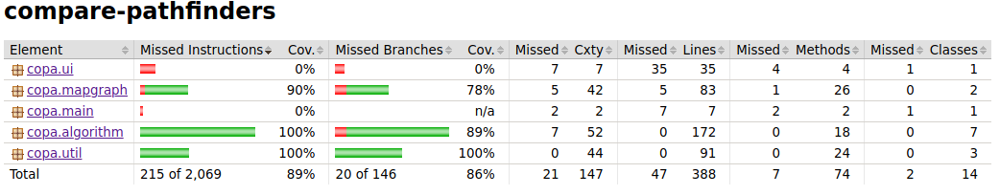
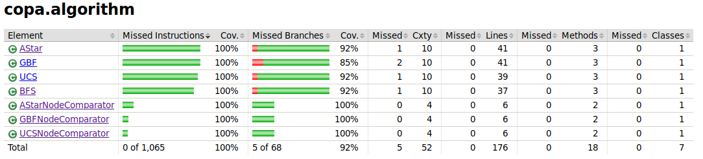
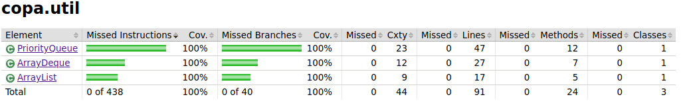

# Testausdokumentti

Ohjelmalle on toteutettu automaattisia JUnit yksikkö- ja integraatiotestejä. Testien rivi- ja haaraumakattavuus on raportoitu JaCoCo:n avulla, josta oheen on liitetty kuvakaappauksia sovelluksen lopullisesta versiosta.

Klikkaamalla oheista Codecov-työkalun linkkiä pääset tarkastelemaan Githubista löytyvän viimeisimmän sovellusversion vastaavia Jacoco-testien tuloksia tarkemmin. Löydät palvelusta mm. metodikohtaiset testauskattavuudet ja testikattavuuden kehitystrendin projektin aikana. Codecov laskee testikattavuuden Jacocon raporteista hieman eri tavalla, jonka vuoksi sen raportoimat kattavuusprosentit ovat hieman Jacocon omia lukuja pienempiä.

## Testauksen kattavuus

Pää- ja käyttöliittymäluokkia ei testata, joten testien rivikattavuus on yli 90% ja suurin osa eri haaroista myös testataan.

## Algoritmien testit

Tästä paketista löytyy vertailtavien algoritmien luokat ja kolmen algortimin osalta myös Comparator-luokat. Rivikattavuus on 100%. Kaikissa metodeissa on testausta, mutta joitakin haaroja on käymättä läpi.

## Kartta- ja solmu-luokkien yksikkötestit

Tästä paketista löytyy MapGraph-luokka, jolla ASCII-tiedosto muokataan verkoksi ja printataan näytölle sekä Node-luokka, joka vastaa karttaruutua eli verkon solmua. Käytännössä kaikki metodit paitsi kartan printtaus on testattu.

## Omien Java.util toteutuksien testaus

Tästä paketista löytyy java.util paketin luokkia ArrayList, ArrayDeque ja PriorityQueue vastaavat omat toteutukset. Luokkia on toteutettu vain siltä osin kuin olen tarvinnut sovelluksen toiminnallisuutta varten. Testien rivi- ja haaraumakattavuus on 100%.

## Parannettavaa testauksessa

* En ehtinyt perehtymään miten saisin testattua kartan tulostuksen toimivuuden, tämä jäi vielä tulevaisuuden opiskelulistalle.
* Algoritmien osalta testaus jäi hyvin pintapuoliseksi, testit varmistavat nyt lähinnä sen, että algoritmi lähtee oikein käyntiin ja itse toteutetut jonoluokat toimivat siiinä oikein. 