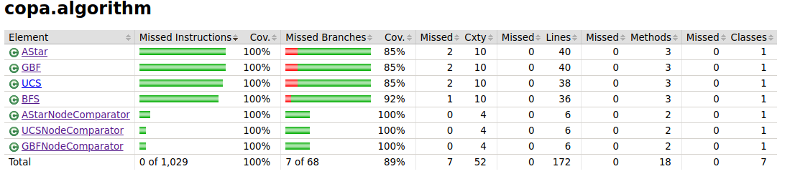

# Testausdokumentti

Ohjelmalle on toteutettu automaattisia JUnit yksikkö- ja integraatiotestejä, testien rivi- ja haaraumakattavuus on raportoitu JaCoCo:n avulla.

## Testauksen kattavuus

Ajantasaisen tiedon testien kattavuudesta saat ajamalla sovelluksen juuressa komentorivillä käskyn ``./gradlew test jacocoTestReport`` ja avaamalla selaimeesi kansioon ./build/reports/jacoco/test/html generoidun html-pohjaisen raportin.

Pää- ja käyttöliittymäluokkia ei testata, joten testien rivikattavuus on yli 90% ja suurin osa eri haaroista myös testataan.

## Algoritmien testit

Tästä paketista löytyy vertailtavien algoritmien luokat ja kolmen algortimin osalta myös Comparator-luokat. Rivikattavuus yli 90%. Kaikissa metodeissa on testausta, mutta joitakin haaroja on käymättä läpi.

## Kartta- ja solmu-luokkien yksikkötestit

Tästä paketista löytyy MapGraph-luokka, jolla ASCII-tiedosto muokataan verkoksi ja printataan näytölle sekä Node-luokka, joka vastaa karttaruutua eli verkon solmua. Käytännössä kaikki metodit paitsi kartan printtaus on testattu. 

## Parannettavaa testauksessa

En ehtinyt perehtymään miten saisin testattua kartan tulostuksen toimivuuden, tämä jäi vielä tulevaisuuden opiskelulistalle.