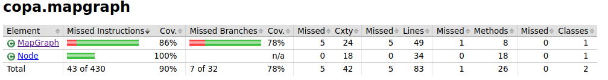

# Testausdokumentti

Ohjelmalle on toteutettu automaattisia JUnit yksikkötestejä.

## Testien kattavuus

Pää- ja käyttöliittymäluokkia ei testata.

## Algoritmit

Tästä paketista löytyy vertailtavien algoritmien Java-luokat ja kolmen algortimin osalta myös Comparator-luokat. Rivikattavuus yli 90%. Kaikissa metodeissa on testausta, mutta joitakin haaroja on käymättä läpi.

## Kartta ja solmu

Tästä paketista löytyy MapGraph-luokka, jolla ASCII-tiedosto muokataan verkoksi ja printataan näytölle sekä Node-luokka, joka vastaa karttaruutua eli verkon solmua. Käytännössä kaikki metodit paitsi kartan printtaus on testattu. En ole ehtinyt perehtymään miten saisin testattua tulostuksen toimivuuden.